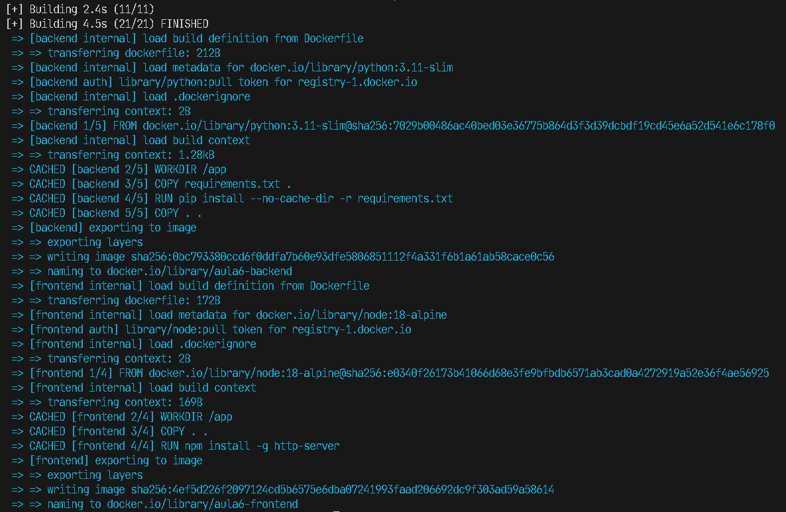
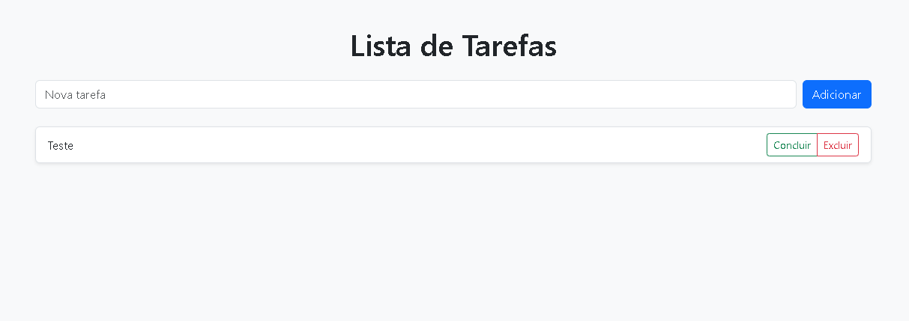

# ✅ ToDo App - Flask + PostgreSQL + Frontend Bootstrap

Aplicação simples de lista de tarefas (**ToDo**) construída com **Flask (Python)** no backend, **PostgreSQL** como banco de dados e um **frontend em HTML/CSS com Bootstrap**.  
O projeto é totalmente containerizado com **Docker** e orquestrado com **Docker Compose**.

---

## 📦 Imagens Docker (Docker Hub)

- 🔧 Backend: [`eduardofelichak/todo-backend`](https://hub.docker.com/r/eduardofelichak/todo-backend)
- 🌐 Frontend: [`eduardofelichak/todo-frontend`](https://hub.docker.com/r/eduardofelichak/todo-frontend)

---

## 🧱 Estrutura do Projeto
```
├── backend/ 
│   ├── app.py 
│   ├── config/ 
│   ├── models/ 
│   ├── routes/ 
│   └── requirements.txt 
├── frontend/ 
│   ├── index.html 
│   ├── js/ 
│   ├── css/ 
│   └── Dockerfile 
├── docker-compose.yml
```

---

## 🚀 Como Executar

### 1. Clonar o repositório

```bash
git clone https://github.com/EduardoFelichak/todo-dockerhub.git
cd todo-dockerhub
```

### 1. Executar com Docker Compose

```bash
docker-compose up
```
A aplicação estará disponível em:
- Frontend: http://localhost:8080
- API: http://localhost:5000/api/tasks/

---

## 🛠️ Passo a Passo do Processo


### 🔨 Build das Imagens
```bash
docker-compose build
```



### 📤 Envio das Imagens para o Docker Hub
```bash
# Backend
docker tag aula6-backend eduardofelichak/todo-backend
docker push eduardofelichak/todo-backend

# Frontend
docker tag aula6-frontend eduardofelichak/todo-frontend
docker push eduardofelichak/todo-frontend
```

### 💻 Execução em Ambiente Remoto

1. Copie o docker-compose.yml abaixo para a máquina remota:
```yaml
version: '3.8'

services:
  db:
    image: postgres:15
    container_name: todo_db
    restart: always
    environment:
      - POSTGRES_DB=todo_db
      - POSTGRES_USER=postgres
      - POSTGRES_PASSWORD=postgres
    ports:
      - "5433:5432"
    volumes:
      - pgdata:/var/lib/postgresql/data

  backend:
    image: eduardofelichak/todo-backend
    container_name: todo_backend
    restart: always
    ports:
      - "5000:5000"
    depends_on:
      - db
    environment:
      - FLASK_ENV=development
      - DB_HOST=db
      - DB_NAME=todo_db
      - DB_USER=postgres
      - DB_PASSWORD=postgres
      - DB_PORT=5432

  frontend:
    image: eduardofelichak/todo-frontend
    container_name: todo_frontend
    restart: always
    ports:
      - "8080:8080"
    depends_on:
      - backend

volumes:
  pgdata:
```

2. Execute na máquina remota:
```bash
docker-compose up
```

---

## 📚 Explicação do `docker-compose.yml`
- **db**: banco de dados PostgreSQL 15, porta 5433 externa.
- **backend**: API Flask, conectada ao banco pelo nome do serviço db, roda na porta 5000.
- **frontend**: página HTML com Bootstrap e JS puro, que consome a API. Porta 8080.

---

## ✅ Funcionalidades da Aplicação
- 📋 Listar tarefas
- ➕ Criar nova tarefa
- ✅ Concluir/desfazer tarefa
- ❌ Excluir tarefa



---

## 👨‍💻 Tecnologias Utilizadas
- Python + Flask
- PostgreSQL
- JavaScript (puro)
- HTML5 + CSS3 + Bootstrap 5
- Docker
- Docker Compose

---

## 📄 Licença

Este projeto é apenas para fins educacionais e não possui licença comercial.

---